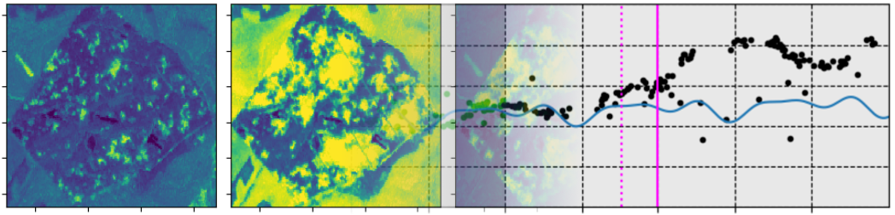

# Processing satellite time-series for forest anomaly detection

---

## 1. Introduction

Here we present a **Python tutorial** for manipulating the **time series of satellite images**, analysing variations and detecting possible anomalies. To do this, we take the example of forest diebacks due to the proliferation of bark beetles in recent years in a large part of Europe.

***keywords**: remote sensing, time-series, sentinel, dieback, anomalies detection*

The tutorial is divided into 5 steps:

- [01_array2files.ipynb](01_array2files.ipynb): we propose here to search through a STAC  catalog the available images according to several criteria (start date, end date, cloudiness, etc.)
- [02_vi_index.ipynb](02_vi_index.ipynb): from the satellite time-series, we calculate vegetation indices for each date and store this new information in a datacube. In a second step, we filter the cube in such a way as to only keep the images that seem useful.
- [03_vi_time-series_plot.ipynb](03_vi_time-series_plot.ipynb): we analyze the VI time-series with the NRT package. The objective is to fully understand how this tool works, by visualizing through plots the time-series values, the modeling by harmonious function and the more or less early detections depending on the methods used.
- [04_optimized_params.ipynb](04_optimized_params.ipynb): we propose here to optimize the parameters to minimize the difference between the reference date and the detection date.
- [05_produce_anomaly_map.ipynb](05_produce_anomaly_map.ipynb): we use the NRT package to produce an image of the diebacks spread.

---

## 2. Data

### 2.1. Satellite images

The tutorial uses the time-series acquired by the **Sentinel-2** constellation ([Copernicus](https://www.copernicus.eu/en) programme). For practical reasons, but also to learn how to manipulate datacubes, we will be using the free *Microsoft Planetary Computer* Cloud service. This service is based on recent standards ([STAC](https://stacspec.org/en), [COG](https://www.cogeo.org/)) that enable spatial data to be discovered and processed effectively online.

However, depending on your needs, you can change provider as long as it complies with the STAC standards. 

### 2.2. Reference data

The tutorial provides three vector files, so you can experiment the NRT package by masking non-forest areas and assessing the results with a few reference data.

- `bd-foret_p33.gpkg`: limits of the studied area, a plot of coniferous forest in the North of France. Taken from BD Foret V2 &copy;IGN
- `plot01_samples.shp`: set of 14 reference points visually interpreted on Sentinel-2 time-series. It gives the start date of dieback (due to bark beetles) at the yellow or red stage (approximation). Produced by &copy;Kenji Ose (2024). 
- `plot01_samples_2.shp`: set of 50 reference points visually interpreted on Sentinel-2 time-series. It gives the start date of dieback (due to bark beetles) at the yellow or red stage (approximation). Produced by &copy;Kenji Ose (2024).

---

## 3. Tools

### 3.1. Method 

The tutorial uses a classic time-series analysis approach. This involves two main stages: 
- **a fitting stage** in which, part of the univariate (i.e. spectral index) time series, considered as "normal", is used to model a harmonic function. For our example, it describes the seasonal variations in a vegetation index for a healthy forest.
- **a monitoring stage** that consists of comparing the predictions of the harmonic function with the actual values in order to detect any anomalies (in this case diebacks).

### 3.2. Python packages

There are many **Python packages for analysing time-series**, but relatively few for easily exploiting satellite data. Here we present two interesting examples:

- the **Fordead package**, developed by [INRAE](https://www.inrae.fr/en) ([TETIS](https://www.umr-tetis.fr/index.php/en/) laboratory): this tool dedicated to the analysis of forest dieback based on time-series of Sentinel-2 images has proven its effectiveness. The Health Forest Department of the French Ministry of Agriculture has used it for several years to produce dieback monitoring maps linked to the bark beetle health crisis in France. As this tool is very well documented, we recommend you to consult the dedicated web pages directly: https://fordead.gitlab.io/fordead_package/

- the **NRT package**, developed by the Joint Research Center (JRC) [D.1. Unit](https://forest.jrc.ec.europa.eu/en/): this tool is intended to be standard in order to gradually integrate different anomaly detection methods on time-series of satellite images. Therefore, unlike Fordead, the NRT package is not dedicated to forestry issues and can possibly be tested on other types of land cover. Detailed documentation is available at the following address: https://nrt.readthedocs.io/en/latest/index.html

All of the exercises presented here are based on the NRT package. Some modules have been added to improve the ergonomics and understanding of this tool.

---

## 4. Installation

The tutorial is designed in the form of **Jupyter notebook** files. You must first install the Python NRT package (follow the documentation for this tool). Depending on the environment chosen, you may need to complete with some packages dedicated to the analysis of spatial data.

---

## 5. Author(s) and support
The tutorials are written by Kenji Ose. 

For any help, comment, etc., please use the issue tracker.

---

## 6. License
GNU GPLv3 
